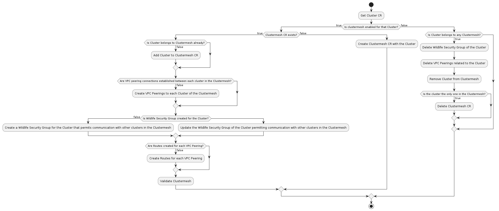
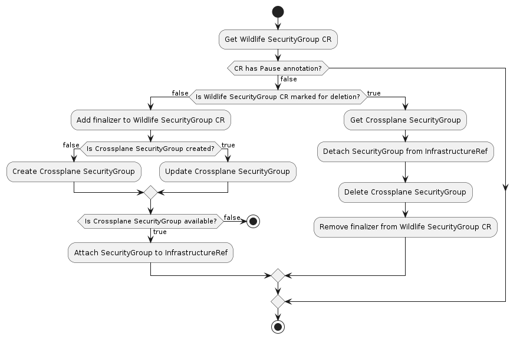

## Glossary
### Clustermesh
Is a network abstraction that facilitates communication among a group of Kubernetes clusters. It offers the essential infrastructure to ensure traffic flow between these clusters. Currently, it exclusively supports clusters running on AWS and comprises AWS VPC Peerings, AWS Security Groups, and AWS Routes.

## Custom Resources
- Clustermesh
This resource has a list of clusters that are part of the [Clustermesh](#clustermesh) alongside with their information. The resource is auto-generated by the Clustermesh Controller when the required label and annotation are applied to the Cluster CRs, it's also to give visibility to the cloud resources created for the Clustermesh.

- Wildlife Security Group
This resource is used as an abstration of the Crossplane Security Group CR so we don't need to specify information like region and VPC ID. It has a list of ingress rules and a list of infrastructure references that are going to use the Security Group. 

## Controllers
- Clustermesh Controller
This is the controller responsible for managing the Clustermesh between the Clusters. It watches `clusters.cluster.x-k8s.io` and create the necessary cloud resources to establish the Clustermesh between them leveraging on Crossplane CRs. 

- Wildlife Security Group Controller
This is the controller responsible for managing AWS Security Groups. It watches `securitygroups.ec2.aws.wildlife.io` which references Kops Operator custom resources and creates `securitygroups.ec2.aws.crossplane.io` CRs with that information. It also is responsible to attach the Security Groups to the referenced resources. 

### Clustermesh Controller
#### How to use
To add a Cluster to a Clustermesh it needs to have a label `clusterGroup` which is the name of the Clustermesh it will be part of and an annotation `clustermesh.infrastructure.wildlife.io: true` to enable it.

#### Diagram


#### Deep Dive
The controller watches for changes in the Cluster CRs and in order to avoid the complexity of having a broad view of everything in the Clustermesh it only worries about the specific cluster that is being reconcilied at the moment, that means that will only create/update the cloud resources for the current cluster. The trick to make this work without generating drifts or missing resources is that we enqueue every other cluster that belongs to the Clustermesh when a cluster is reconciled. This way we can focus only in the current cluster during the reconciliation.

The cloud resources are created using Crossplane CRs and mapped using Kubernetes ownership relationships to be easier to retrieve and cleanup them. The resources are also mapped in the status of the Clustermesh CR for visibility.

The normal reconciliation have four main steps:
- Retrieve the cluster information
- Reconcile the VPC peerings
- Reconcile the Security Groups
- Reconcile the Routes

##### Retrieve the cluster information
When a reconciliation is triggered the controller retrieves the necessary information of the current Cluster. If the Cluster already belongs to the Clustermesh the controller will update that information, if not the Cluster will be added to the Clustermesh CR alongside with the needed information. 

##### Reconcile the VPC peerings
A VPC peering connection is a one to one relationship between two VPCs, because of that we create the peering using `<origin-cluster>-<destination-cluster>` as the name of the peering so we can easily identify if the peering between two VPCs are already created.

##### Reconcile the Security Groups
Security Groups are created leveraging the Security Group Controller. When the Clustermesh Controller reconciles a Cluster, it creates a Security Group CR for that Cluster. This CR allows the VPC of other Clusters within the Clustermesh to communicate. The Security Group Controller then creates the Security Group in AWS and attaches it to the necessary resources.

##### Reconcile the Routes
Routes are created using the VPC peering as the target, so after verifying that the VPC peering is already in a ready state, the controller creates a route in every route table of the cluster being reconciled to every VPC peering that is part of the Clustermesh.

The deletion happens when a cluster don't have both the label and annotation and still is part of a Clustermesh, this is checked by going through every Clustermesh spec and verifying its clusters. When that happens it first delete the security group associated with the cluster. After that it proceeds to remove the vpc peerings associated with the cluster, this will indirectly also remove the routes because of their ownership relationship. At the end if the cluster is the last one in the Clustermesh CR it will delete the CR as well. The deletion process relies uses the status of the Clustermesh resource as the source of truth.

#### Limitations
- It only supports AWS as a cloud provider.
- It only supports Clusters using KopsControlPlane as a control plane provider.
- A Cluster can only belong to one Clustermesh at a time.

### Security Group Controller
#### How to use
Create a `securitygroups.ec2.aws.wildlife.io` CR with the desired configuration. Here's an example of a CR that creates a Security Group with one ingress rule and attaches it to two KopsMachinePools:
```yaml
apiVersion: ec2.aws.wildlife.io/v1alpha2
kind: SecurityGroup
metadata:
  name: test-security-group
spec:
  infrastructureRef:
  - apiVersion: infrastructure.cluster.x-k8s.io/v1alpha1
    kind: KopsMachinePool
    name: nodes-a
    namespace: k8s-test-cluster-us-east-1-general-testing
  - apiVersion: infrastructure.cluster.x-k8s.io/v1alpha1
    kind: KopsMachinePool
    name: nodes-b
    namespace: k8s-test-cluster-us-east-1-general-testing
  ingressRules:
  - allowedCIDRs:
    - 0.0.0.0/0
    fromPort: 1000
    ipProtocol: udp
    toPort: 1000
```

#### Diagram


#### Deep Dive
The controller watches for changes in the Security Group CRs and creates the Crossplane CR that reflects it, after the Crossplane CR is reporting in its status that it's ready, the controller attaches them to the resources referenced in the CR. The reconciliation starts by retrieving the required information from the referenced resources, they are the providerConfigName that is going to be used as credentials in the Crossplane resource, the region, and the VPC ID. The next step is to create the crossplane resource with the information retrieved and the desired configuration. After that the controller waits for the Crossplane resource to be ready by checking its status and enqueing the SecurityGroup CR again if it's not ready. When the Crossplane resource is ready the controller attaches it to the resources referenced in the SecurityGroup CR, the attachment is made in the AWS API using its SDK, both in the configuration resource like ASGs and LTs, but also in the EC2 instances to avoid drifts.

The SecurityGroup CR has a finalizer to allow to proper detachment of the Security Group from the resources referenced before it's deleted. The deletion process is similar to the creation process, but in reverse. The controller first detaches the Security Group from the resources and then deletes the Crossplane resource. After that it removes the finalizer from the SecurityGroup CR and deletes it.

#### Limitations
- Today only supports KopsMachinePool and KopsControlPlane as infrastructure references.
- It don't support egress rules yet.

## Running

Before you start make sure you have access to the AWS account where you'll be creating your resources for testing. Also on your machine you should have Docker and tilt properly configured, including [enable kubernetes on docker](https://docs.docker.com/desktop/kubernetes/). Next we can start running

```
make setup-dev-env
```

The script will start up tilt and by the end you'll be able to open tilt UI by pressing SPACE. On that UI you'll see 8 resources on your control cluster stuck on the `Waiting on Wait AWS Credentials` step. 

Now open a new shell and set the environment vars for the AWS credentials of the account you'll use, next run the following script to create the necessary kubernetes secrets with those credentials in your local tilt cluster.

```
./hack/scripts/aws-provider-config.sh
```
If the script is successful you should see that all the components on tilt UI are running after a while.

Now run the following script to create your testing resources

```
KOPS_DOMAIN=your.k8s.domain KOPS_BUCKET=kops-config-bucket KOPS_ZONE=aws-zone hack/scripts/apply-cluster-crs.sh kaas-cluster
```

TODO:
- Explanation about pause annotations
- Explanation about how the credendials are being used
- Complement the documentation with the work being done in the deletion process